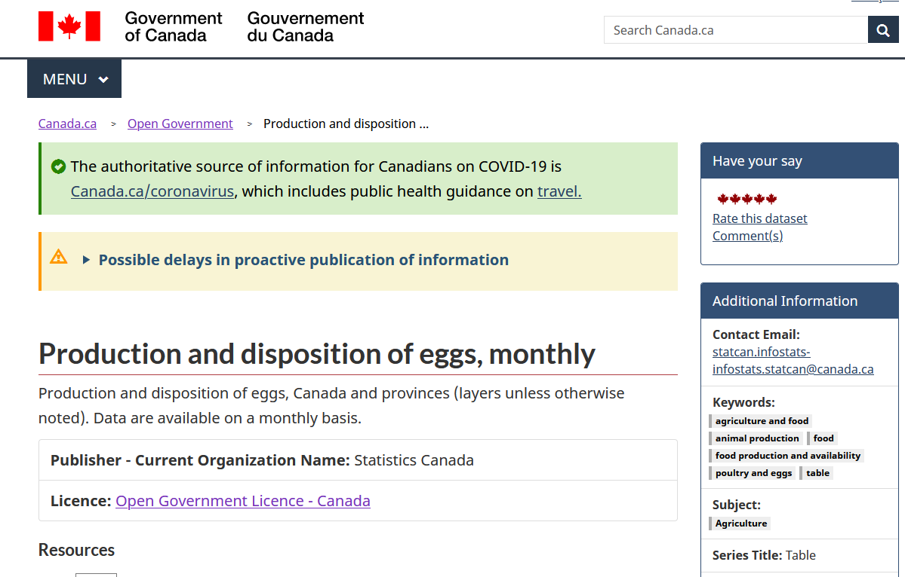
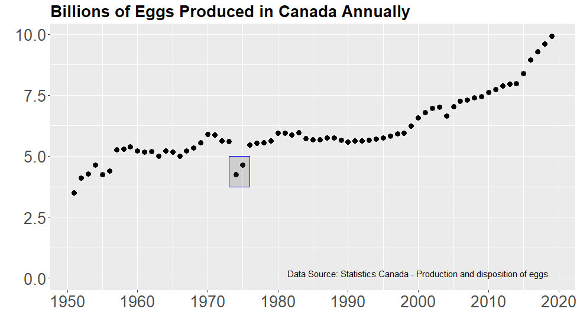
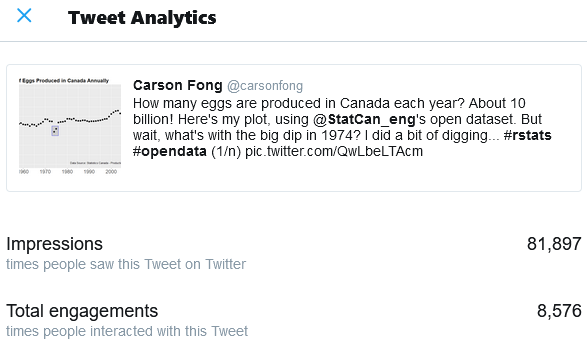

A few months ago, I was analyzing a great [open data set](https://open.canada.ca/data/en/dataset/91128b7e-bae0-4659-929e-6fb4bbe8a12a) from the Canadian government that detailed egg production in Canada. It seemed like a high quality dataset, stretching all the way back to the 1950s.



The production trend was pretty steady throughout the years, with the sharp increase in the last 5 years. However, there was a sudden drop in production in 1974 and 1975. 



Intrigued, I dug around to find a cause.

I found [this story](https://www.cbc.ca/archives/entry/1974-28-million-rotten-eggs) from the CBC Archives about a botched implementation of price fixing, that seemed to line up with this drop in production

The tens of millions of wasted eggs in the story seemed to line up with the drop I saw in the data, and I decided that this was the most likely cause.

Assuming a couple people on Twitter would find this mildly interesting, so I posted the story in a thread.

```{r echo=FALSE}
blogdown::shortcode('tweet', '1254144326243954688')
```

The post was way more popular than I could've imagined, garnering 80000 impressions and 8000 engagements. It was by far the most viewed thing I had ever shared on the internet.



Much of this can be attributed to a retweet by Hadley Wickham, Chief Scientist at RStudio and practically a demigod within the #rstats community. 

I was over the moon to be noticed. At the same time, I was anxious about how much attention the thread was getting. My analysis was whimsical, unstructured, and suggested a causal conclusion without due process. What if I was wrong?

A couple days later, these anxieties became true when [@xangregg](https://twitter.com/xangregg) provided a much likelier explanation - a simple mislabeling error in the data.

```{r echo=FALSE}
blogdown::shortcode('tweet', '1255118770613485568')
```

I was:
- Disappointed that there wasn't a neat policy story here. 
- Embarrassed that I didn't catch the labeling error. In hindsight, the anomalies were too outlandish to be true.
- Grateful that Xan actually took the time to dig into the study as well. It was better to have this false story nipped in the bud than have it spread any further.

This 72 hour saga brought home a few takeaways that I was always aware of, but hadn't ever experienced firsthand:

## An original falsehood spreads more easily than corrections

My original tweet was seen over 80 000 times. The tweet where I quoted xangregg's correction was only seen 500 times.

People scroll through their feeds, see something interesting, share it, and move on. It's difficult to draw them back to the original story if there's an update or correction.

This puts the onus on the original poster to do what they can to ensure that the story they're sharing is valid. Misinformation, even when unintentional, is hard to undo.

## Being open and transparent will improve your ideas

Sharing the data and code alongside the story made it easy for Xan to dig into it as well. 

Open data and science promote collaboration and quick iteration. By showing our work and inviting feedback, our output is better for it.

## Publishing online is exciting and nervewracking

I look forward to posting more graphs online. It is a great way to learn, and you never know who's interest you'll capture.

Assume your ideas will be seen widely though - conduct your analysis accordingly!